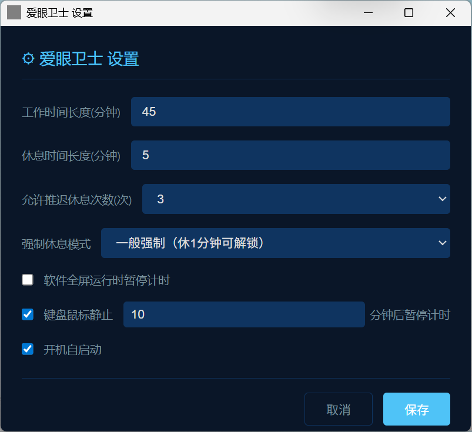

# 爱眼卫士 (EyeGuard)

**爱眼卫士** 是一款 Rust+Tauri 2.0 编写的Windows 桌面定时休息护眼软件，帮助用户定时锁定屏幕（支持多屏幕），离开电脑休息，保护视力。本软件占用内存小，6M左右。
- 本软件借助AI生成，大量参考借鉴眼睛护士EyeFoo软件，增加了多屏幕锁定支持，感谢原作者！

## 功能特性

### 工作 / 休息双状态
- **工作时**：桌面右上角显示倒计时窗口，以 MM:SS 格式实时显示距下次休息的时间，背景进度条随倒计时逐渐消退
  
- **休息时**：锁定所有屏幕（主屏 + 扩展屏），全屏黑色遮罩，居中显示休息倒计时，屏蔽 Win 键、Alt+Tab、Alt+F4
   
  
### 右键菜单
- 立即休息、推迟休息（3/5/10 分钟，可配置总推迟次数）
- 窗口置顶 / 取消置顶
- 设置属性、关闭退出
  
### 三种强制休息模式
- **非强制**：休息时可随时点击解锁图标解锁
- **一般强制**：休息 1 分钟后显示解锁图标，点击解锁
- **完全强制**：休息期间不可解锁，必须等到倒计时结束

### 倒计时提示
- 距休息还剩 3 分钟时弹窗提示，同时播放 `breakpre.mid` 提示音
- 休息开始时播放 `break.mid`，结束后播放 `unlock.mid` 提示音

### 设置属性
- 工作时间长度（分钟）
- 休息时间长度（分钟）
- 允许推迟休息次数（1-6 次）
- 键盘鼠标静止N分钟后暂停计时（恢复后重新计时）
- 全屏运行时暂停计时（支持检测全屏应用如 PPT、浏览器 F11、游戏等）
- 开机自启动
  
  
### 其他特性
- 多屏幕支持（不同分辨率和缩放比例）
- 单实例运行
- 系统托盘图标
- 深色科技简洁风格 UI
- 窗口可拖拽移动，无边框设计

## 技术栈

- **语言**: Rust
- **框架**: Rust+Tauri 2.0
- **目标平台**: Windows

## 项目结构

```
EyeGuard_RustTauri/
├── frontend/                # 前端界面
│   ├── index.html          # 主窗口（倒计时）
│   ├── settings.html       # 设置窗口
│   ├── warning.html        # 提醒窗口
│   ├── lock.html           # 锁屏窗口
│   └── styles/
│       └── theme.css       # 主题样式
├── sounds/                  # 音频文件
│   ├── break.mid           # 休息提醒音
│   ├── breakpre.mid        # 预提醒音
│   └── unlock.mid          # 解锁音效
├── src-tauri/               # Rust 后端
│   ├── src/
│   │   ├── main.rs         # 入口
│   │   ├── lib.rs          # 主逻辑
│   │   ├── audio.rs        # 音频播放
│   │   ├── autostart.rs    # 开机自启
│   │   ├── fullscreen_detect.rs  # 全屏检测
│   │   ├── idle_detect.rs  # 空闲检测
│   │   ├── keyboard_hook.rs # 键盘钩子
│   │   ├── screen_lock.rs  # 屏幕锁定
│   │   ├── settings.rs     # 设置管理
│   │   ├── state.rs        # 状态管理
│   │   └── tray.rs         # 系统托盘
│   ├── Cargo.toml          # Rust 依赖
│   ├── tauri.conf.json     # Tauri 配置
│   └── build.rs            # 构建脚本
├── package.json             # Node.js 依赖
└── README.md
```
## 环境要求

### 开发环境

- **Rust**: 1.70+ （推荐使用 [rustup](https://rustup.rs/) 安装）
- **Windows SDK**: 用于 Windows API 调用

> **可选**: Node.js 18+ （仅用于 npx 方式运行 tauri-cli）


## 构建与运行

### 生产构建

提供两种方式，任选其一：

### 方式一：使用 Node.js (npx)

```bash
# 安装依赖
npm install

# 开发模式
npx tauri dev

# 生产构建
npx tauri build
```

### 方式二：纯 Rust (无需 Node.js)

```bash
# 安装 tauri-cli
cargo install tauri-cli

# 开发模式
cargo tauri dev

# 生产构建
cargo tauri build
```

构建完成后，安装包位于 `src-tauri/target/release/bundle/` 目录下。

### 直接运行

开发或构建后，可执行文件位于：
- Debug 版本: `src-tauri/target/debug/eyeguard.exe`
- Release 版本: `src-tauri/target/release/eyeguard.exe`

## 绿色版使用说明

如果需要将程序作为绿色软件使用，请确保以下目录结构：

```
目标目录/
├── eyeguard.exe
└── sounds/
    ├── break.mid
    ├── breakpre.mid
    └── unlock.mid

```

或者 

```
目标目录/
├── eyeguard.exe
└── _up_/
    └── sounds/
        ├── break.mid
        ├── breakpre.mid
        └── unlock.mid

```

## 配置文件

配置文件存储在用户配置目录：
- Windows: `%APPDATA%\EyeGuard\settings.toml`

默认配置：
```toml
work_interval_minutes = 45      # 工作时长（分钟）
rest_duration_minutes = 5       # 休息时长（分钟）
max_postpone_count = 3          # 最大推迟次数
force_mode = "soft"             # 强制模式: none/soft/hard
pause_on_fullscreen = false     # 全屏时暂停
idle_detect_enabled = true      # 空闲检测
idle_threshold_minutes = 5      # 空闲阈值（分钟）
```

## 强制模式说明

| 模式 | 说明 |
|------|------|
| `none` | 无强制，用户可随时解锁 |
| `soft` | 软强制，休息 1 分钟后可解锁 |
| `hard` | 硬强制，必须等待休息结束才能解锁 |

## 技术栈

- **前端**: HTML/CSS/JavaScript
- **后端**: Rust + Tauri 2.0
- **UI 框架**: 原生 Webview
- **音频**: Windows MCI (MIDI)

## 许可证

MIT License
